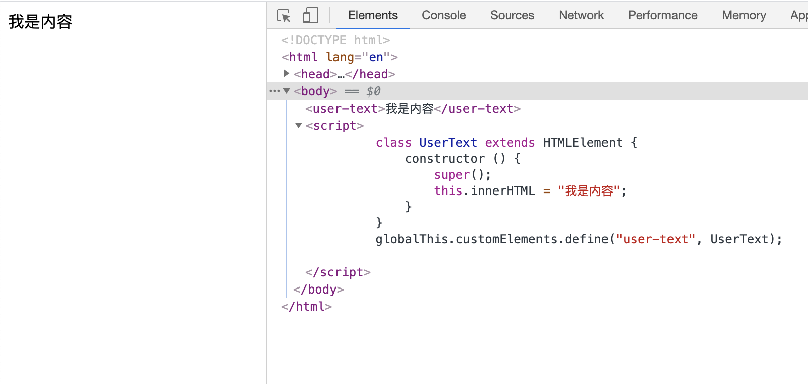
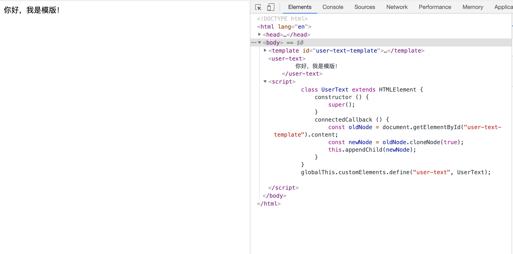
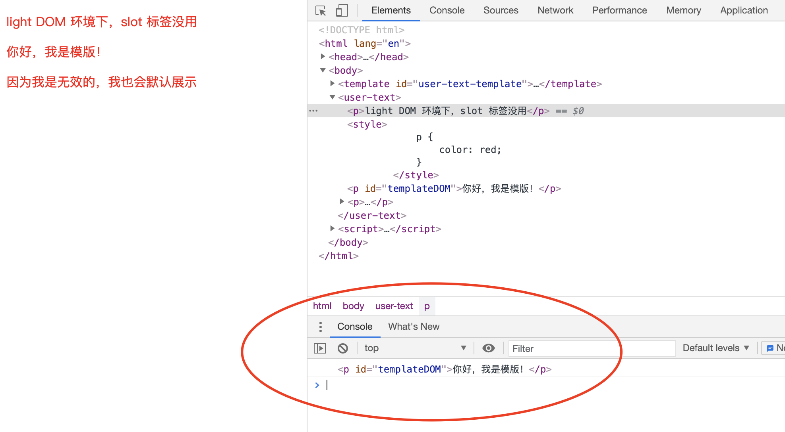
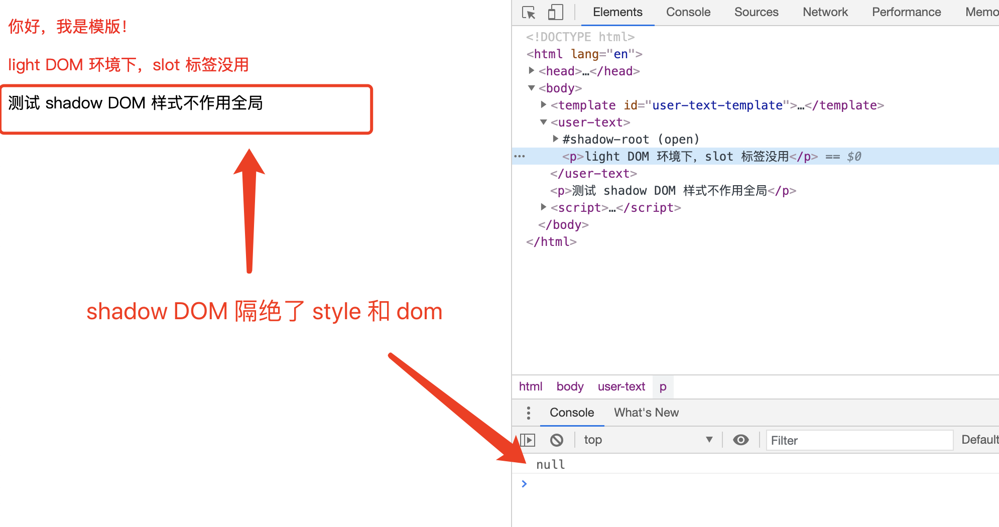

# Webcomponents

## 前端组件化

无论你用什么流行框架去写前端，本质上你都是在使用前端三剑客即： HTML、CSS 和 JavaScript。那这三剑客在自己的领域`组件化/模块化`做的怎么样了呢？

- 对于 CSS，我们有 `@impot`。
- 对于 JS 现在也有模块化方案。

那么对于 HTML 呢？我们知道样式和脚本都是集成到 HTML 中，所以所以单独的去做 HTML 模块化，没有任何意义。

既然如此，我们看看 HTML 在编程过程中遇到了什么问题。

1. 因为 CSS 样式作用在全局，就会造成样式覆盖。
2. 因为在页面中只有一个 DOM，任何地方都可以直接读取和修改 DOM。

可以看到我们的痛点就是解决 **CSS 和 DOM 这两个阻碍组件化的因素**，于是 Web Components 孕育而生。

## Web Components

[Web Components](https://developer.mozilla.org/zh-CN/docs/Web/Web_Components) 由三项主要技术组成：

- [Custom elements（自定义元素）](https://developer.mozilla.org/zh-CN/docs/Web/Web_Components/Using_custom_elements)。
- [Shadow DOM（影子 DOM）](https://developer.mozilla.org/zh-CN/docs/Web/Web_Components/Using_shadow_DOM)。
- [HTML templates（HTML模板)](https://developer.mozilla.org/zh-CN/docs/Web/Web_Components/Using_templates_and_slots)。

Web Components 整体知识点不多，内容也不复杂，我认为核心就是[Shadow DOM（影子 DOM）](https://developer.mozilla.org/zh-CN/docs/Web/Web_Components/Using_shadow_DOM)：

- 影子 DOM 中的元素对于整个网页是不可见的；
- 影子 DOM 的 CSS 不会影响到整个网页的 CSSOM，影子 DOM 内部的 CSS 只对内部的元素起作用。

## 自定义元素（Custom elements）

> 如何自定义元素或叫如何自定义标签

自定义元素就像 Vue 和 React 中的类组件，首先我们需要使用 ES2015 语法来定义一个类，接着，使用浏览器原生的 customElements.define() 方法，告诉浏览器我要注册一个元素/标签 `user-text`，（自定义元素的名称必须包含连词线，用与区别原生的 HTML 元素，就像 React 的自定义组件名使用时必须大写一样）。

```js
class UserText extends HTMLElement {
    constructor() {
        super();
    }
}
```

上面代码中，UserText 是自定义元素的类，这个类继承了 HTMLElement 父类。

我们现在把 `user-text` 作为标签使用，放到页面上去：

```html
<!DOCTYPE html>
<html lang="en">
<head>
	<meta charset="UTF-8">
	<meta name="viewport" content="width=device-width, initial-scale=1.0">
	<title>Document</title>
</head>
<body>
	<user-text></user-text>
	<script>
		class UserText extends HTMLElement {
			constructor () {
				super();
				this.innerHTML = "我是内容";
			}
		}
		globalThis.customElements.define("user-text", UserText);
	</script>
</body>
</html>
```

我们看到页面成功渲染：



组件会有生命周期，所以这个类还有些方法：

- connectedCallback：当 custom element 首次被插入文档 DOM 时，被调用，俗称组件上树。
- disconnectedCallback：当 custom element 从文档 DOM 中删除时，被调用，俗称组件下树或组件消亡。
- adoptedCallback：当 custom element 被移动到新的文档时，被调用，这个 API 常和 document.adoptNode 配合使用。
- attributeChangedCallback: 当 custom element 增加、删除、修改自身属性时，被调用，俗称组件更新。

## 模板 (Templates)

页面上的元素最终是要给用户呈现内容，在自定义组件里，我们通过字符串的方式来接受要展现给用户的内容，这种方式非常不利于组织我们的 HTML，我们需要一个写 HTML 的地方，这个技术就是模板 (Templates)，非常像 Vue 的模版渲染，如果你熟悉 Vue ，完全可以无障碍切换。

我们随便来弄点数据组织下代码，在浏览器展示给用户：

```html

<!DOCTYPE html>
<html lang="en">
<head>
	<meta charset="UTF-8">
	<meta name="viewport" content="width=device-width, initial-scale=1.0">
	<title>Document</title>
</head>
<body>
	<template id="user-text-template">
		你好，我是模版！
	</template>
	<user-text></user-text>
	<script>
		class UserText extends HTMLElement {
			constructor () {
				super();
			}
			connectedCallback () {
				const oldNode = document.getElementById("user-text-template").content;
				const newNode = oldNode.cloneNode(true);
				this.appendChild(newNode);
			}
		}
		globalThis.customElements.define("user-text", UserText);
	</script>
</body>
</html>
```

我们看到页面成功渲染：



如果，自定义元素需要动态传值给我们的自定义组件，可以使用插槽 slot，语法基本同 Vue，但是此时还无法演示，因为 slot 标签对标准的 DOM（更专业点叫 light DOM）无效，只对 shadow DOM 是有效的，看下使用示例。

```html
<!DOCTYPE html>
<html lang="en">
<head>
	<meta charset="UTF-8">
	<meta name="viewport" content="width=device-width, initial-scale=1.0">
	<title>Document</title>
</head>
<body>
	<template id="user-text-template">
		<style>
			p {
				color: red;
			}
		</style>
		<p id="templateDOM">你好，我是模版！</p>
		<p><slot>因为我是无效的，我也会默认展示</slot></p>
	</template>
	<user-text>
		<p>light DOM 环境下，slot 标签没用</p>
	</user-text>
	<script>
		class UserText extends HTMLElement {
			constructor () {
				super();
			}
			connectedCallback () {
				const oldNode = document.getElementById("user-text-template").content;
				const newNode = oldNode.cloneNode(true);
				this.appendChild(newNode);
			}
		}
        globalThis.customElements.define("user-text", UserText);
        console.log(document.getElementById("templateDOM"));
	</script>
</body>
</html>
```

看下页面加载显示：



除了，slot 无法使用，我们还观察到 template 元素及其内容不会在 DOM 中呈现，必须通过 JS 的方式去访问、style 标签内的样式是作用到全局的、template 里面的 DOM 也可以被全局访问。

## 影子 DOM（shadow DOM）

影子 DOM 是 Web Components 核心中的核心，可以一举解决我们前面提到的，CSS 和 DOM 作用全局的问题。

```html
<!DOCTYPE html>
<html lang="en">
<head>
	<meta charset="UTF-8">
	<meta name="viewport" content="width=device-width, initial-scale=1.0">
	<title>Document</title>
</head>
<body>
	<template id="user-text-template">
		<style>
			p {
				color: red;
			}
		</style>
		<p id="templateDOM">你好，我是模版！</p>
		<p><slot>因为我是无效的，我也会默认展示</slot></p>
	</template>
	<user-text>
		<p>light DOM 环境下，slot 标签没用</p>
	</user-text>
	<p>测试 shadow DOM 样式不作用全局</p>
	<script>
		class UserText extends HTMLElement {
			constructor () {
				super();
			}
			connectedCallback () {
				this.attachShadow({ mode: "open" });
				const oldNode = document.getElementById("user-text-template").content;
				const newNode = oldNode.cloneNode(true);
				this.shadowRoot.appendChild(newNode);
			}
		}
        globalThis.customElements.define("user-text", UserText);
        console.log(document.getElementById("templateDOM"));
	</script>
</body>
</html>
```

现在完成了，组件的样式应该与代码封装在一起，只对自定义元素生效，不影响外部的全局样式、DOM 默认与外部 DOM 隔离，内部任何代码都无法影响外部，同时 slot 也生效了，看下页面加载显示：



## style 穿越 影子 DOM

任何项目为了统一风格，肯定需要有公共样式，而且为了方面是统一引入的，这就涉及到外部样式影响到内部样式，那怎么突破影子 DOM 呢？

### CSS 变量

```html
<!DOCTYPE html>
<html lang="en">
<head>
	<meta charset="UTF-8">
	<meta name="viewport" content="width=device-width, initial-scale=1.0">
	<title>CSS 变量样式穿透</title>
	<style>
		[type="primary"] {
			--ui-button-border: 1px solid transparent;
			--ui-button-background: deepskyblue;
			--ui-button-color: #fff;
		}
	</style>
</head>
<body>
	<template id="ui-button-template">
		<style>
			button {
				cursor: pointer;
				padding: 9px 1em;
				border: var(--ui-button-border, 1px solid #ccc);
				border-radius: var(--ui-button-radius, 4px);
				background-color: var(--ui-button-background, #fff);
				color:  var(--ui-button-color, #333);
			}
		</style>
		<button ><slot></slot></button>
	</template>
	<ui-button type="primary">按钮</ui-button>
	<script>
		class UiButton extends HTMLElement {
			constructor () {
				super();
			}
			connectedCallback () {
				this.attachShadow( { mode: "open" });
				const oldNode = document.getElementById("ui-button-template").content;
				const newNode = oldNode.cloneNode(true);
				this.shadowRoot.appendChild(newNode);
			}
		}
        globalThis.customElements.define("ui-button", UiButton);
	</script>
</body>
</html>
```

页面展示效果图：


### ::part

```html
<!DOCTYPE html>
<html lang="en">
<head>
	<meta charset="UTF-8">
	<meta name="viewport" content="width=device-width, initial-scale=1.0">
	<title>::part 样式穿透</title>
	<style>
		[type="primary"]::part(button) {
			cursor: pointer;
				padding: 9px 1em;
				border: 1px solid #ccc;
				border-radius: 4px;
				background-color: skyblue;;
				color:  #987;
		}
	</style>
</head>
<body>
	<template id="ui-button-template">
		<button part="button"><slot></slot></button>
	</template>
	<ui-button type="primary">按钮</ui-button>
	<script>
		class UiButton extends HTMLElement {
			constructor () {
				super();
			}
			connectedCallback () {
				this.attachShadow( { mode: "open" });
				const oldNode = document.getElementById("ui-button-template").content;
				const newNode = oldNode.cloneNode(true);
				this.shadowRoot.appendChild(newNode);
			}
		}
        globalThis.customElements.define("ui-button", UiButton);
	</script>
</body>
</html>
```

## HTML 原生组件支持 Web Components 

我们知道 HTML5 有很多的原生组件，例如：`input，video，textarea，select，audio` 等。

如果你审查元素会发现，这个组件并不是纯正的原生组件，而是基于 Web Components 来封装的。

如果你审查元素没有显示影子 DOM，请打开控制台，同时检查浏览器设置 `Settings -> Preferences -> Elements` 中把 `Show user agent shadow DOM` 打上勾。

## 落地应用有哪些？

首先，github 网址是完全基于 Web Components 来开发的，其次 Vue 和 小程序 也是基于  Web Components 来做组件化的，而且 Web Components 作为最底层的技术完全可配合 Vue 和 React 等框架，直接使用的。

## 组件库

当我们谈到在项目中如何应用，我们首先需要两个东西，选个 UI 组件库，同时有比较好的工具来操作这个 UI 库，我提供两个给你参考。

- https://xy-ui.codelabo.cn/docs/#/
- https://lit-element.polymer-project.org/

## 参考

- [An Introduction to Web Components](https://css-tricks.com/an-introduction-to-web-components/)
- [MDN - Web_Components](https://developer.mozilla.org/zh-CN/docs/Web/Web_Components)
- [Web Components 入门实例教程](http://www.ruanyifeng.com/blog/2019/08/web_components.html?utm_campaign=Weekly%20collection%20by%20Knovour&utm_medium=email&utm_source=Revue%20newsletter)