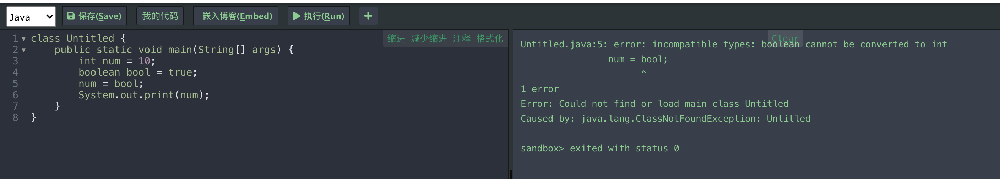
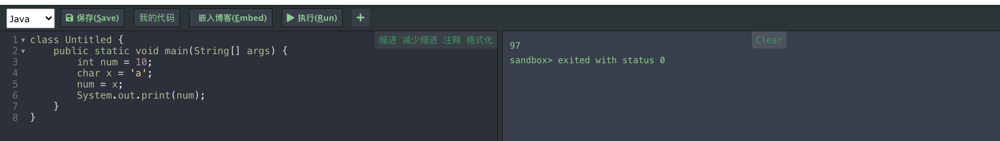
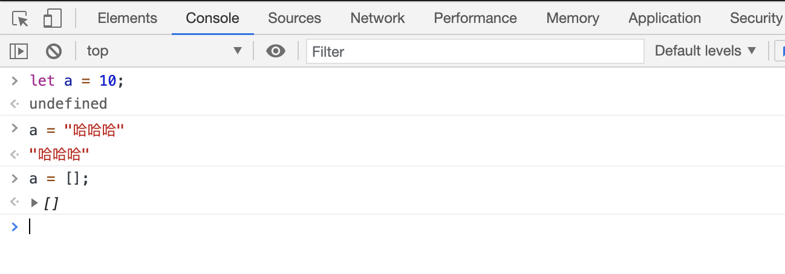

# 重塑类型思维

## 类型思维的缺失

我们知道 JavaScript 是类型是一门**动态弱类型语言**，与此对应就有**静态强类型**语言，例如大家熟知的 C 与 Java 等。JavaScript 作为一门 **动态弱类型语言**，其简单灵活是它最大的特点，但是长期在这种环境下编程，给我们造成的一大遗憾就是**类型思维的缺失**。

随着现代软硬件的升级，不同以往，前端的项目也越做越大，这种遗憾就变成了无法忍受的痛点，现在项目急需静态类型检查，相应的前端开发者也要重塑类型思维，面对日益变化的前端环境。

在静态类型检查方面：

2014 年 Facebook 推出了 Flow ，同年 Microsoft 也推出了 TypeScript，早期 Flow 明显暂了上风，包括 Vue、React、Jest、Yarn 等前端流行框架和工具都是用 Flow 来写的，但是经过这么多年的发展，很明显 TypeScript 完美胜出。

什么是 TypeScript？

> 根据官方的定义：拥有类型系统的 JavaScipt 超集。

具体点体现在三个方面：

- 类型检查
- 语言扩展
- 工具属性 

TypeScript 对我们的好处，除了上面讲到的重塑类型思维，还有个你无法拒绝的优点，TypeScript 会让我们**由代码的编写者，变为代码的设计者**，这非常重要。

在我们进入学习 TypeScript 之前，我还想和你唠唠**强类型与弱类型**和**动态类型与静态类型**的区别。

## 强类型与弱类型

强类型语言：不允许改变变量的类型，除非进行强制类型转换。 
弱类型语言：变量可以赋值给不同的数据类型。

强类型语言演示：Java

除非强制类型转化：

Java 在线演示网址：https://tool.lu/coderunner/

弱类型语言演示：JS

更直观的解释是，强类型变量和值都有类型，弱类型只有值有类型，变量没类型。

## 动态类型与静态类型

静态类型语言：在**编译阶段**确定所有变量的类型。 
动态类型语言：在**执行阶段**确定所有变量的类型。

## 护身符 🧿

学习 TypeSccript 可能会有各种困难，送你个护身符，死死的记住这句话在 TypeScript 中：

一切皆是类型

