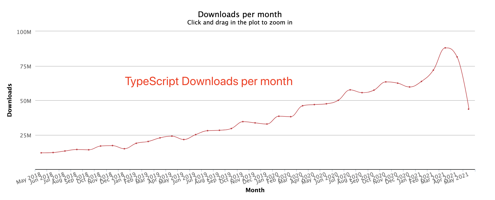

# 客观感受下 TypeScript 的流行程度

截止到 2021-05-18，React、Vue、TypeScript 全网下载量分别为：
<main >
    <table style="text-align: center;display: table; margin: 1em auto">
        <thead>
            <tr>
                <th>Package</th>
                <th>Downloads</th>
            </tr>
        </thead>
        <tbody>
            <tr>
                <td>Vue</td>
                <td>199,989,540</td>
            </tr>
            <tr>
                    <td>TypeScript</td>
                    <td>1,403,887,461</td>
            </tr>
            <tr>
                <td>React</td>
                <td>983,156,397</td>
            </tr>
        </tbody>
    </table>
</main>
TypeScript 铁定定的王者，下载量超过 React + Vue 的总和。

接下来直观感受下 TypeScript 2018-05-01 到 2021-05-18 的月下载量：

> 数据来源：[npm 包下载量](https://npm-stat.com/charts.html?package=typescript&from=2018-05-01&to=2021-05-18)

<Clock/>
