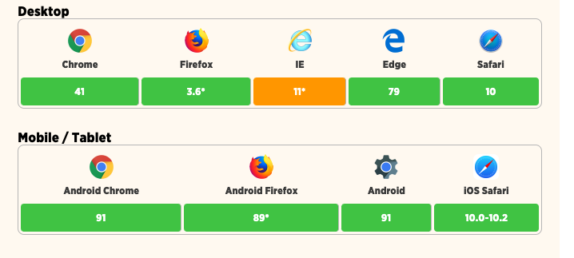
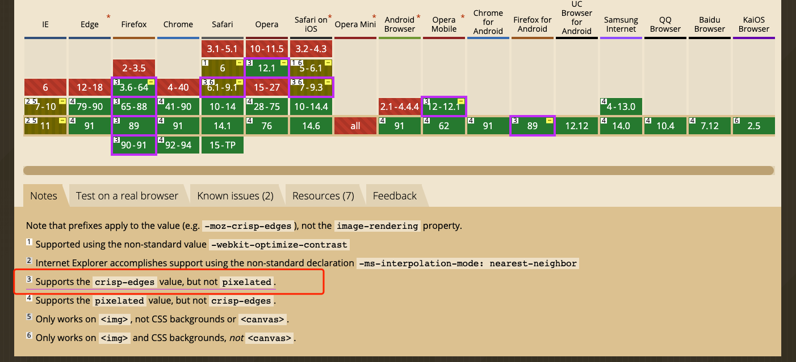
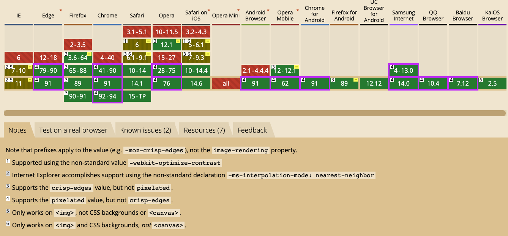

# image-rendering

[[toc]] 

## 起源

平时我们很少会注意到一个现象，就是默认情况下，每个浏览器都会尝试对缩放后的图像应用混叠模式以防止图片失真，但如果希望图像保留其原始像素形式，这有时可能是一个问题。

image-rendering 就是用来解决这个问题的，image rendering 属性定义如果图像从原始尺寸放大或缩小，浏览器应如何渲染图像。

```css
img {
    image-rendering: auto;
    image-rendering: crisp-edges;
    image-rendering: pixelated;
}
```

image-rendering 关于这三个可能的值：

- `auto`：默认值，使用浏览器的标准算法最大化图像外观的默认值。

- `crisp-edges`：对比度，颜色和边缘的图像将被保留，没有任何平滑或模糊。根据规格，这是专门为像素艺术。此值适用于放大或缩小的图像。

- `pixelated`：随着图像大小的变化，浏览器将通过使用最近邻缩放来保持其像素化样式，注意此值仅适用于放大的图像。

此属性可以应用于背景图像、画布元素以及内联图像。但是需要注意的是，由于缺乏一致的浏览器支持，此时测试这些值尤其容易混淆，所以以下演示都是在 Chrome 上进行的。

## 案例

这里有一个 base64 位的图片：

<main style="text-align: center;" >
    
    <h6>上面是个图片</h6>
</main>

图片的源码如下：
```css

```

当我们试着在 Chrome（91）把图片的宽变成 `300px` 我们将发现浏览器擅作主张，已尝试尽可能优化图像，优化之后的结果变成了这样：

<main style="text-align: center;" >
    
    <h6>设置图片的宽为 <code>300px</code></h6>
</main>

要保留图片的原始像素化，我们可以使用 `pixelated` 值，给图片的样式添加如下代码：

```css
img {
    image-rendering: pixelated;
}
```

渲染结果如下所示：

<main style="text-align: center;" >
    
    <h6><code>image-rendering: pixelated;</code></h6>
</main>

## 二维码的例子

`image-rendering` 这是一个在项目中**可能**会用到的例子，当图片非常小，增大图片而不让图片变形：

可点击全屏状态下观看，效果更好。

<button>
    <a href="https://codepen.io/robinrendle/full/EaOJeq/" target="_blank">全屏按钮</a>
</button>

<br />

<main style="height: 542px">
    <iframe allowfullscreen="true" allowpaymentrequest="true" allowtransparency="true" class="cp_embed_iframe" style="width: 100%; overflow: hidden; display: block; height: 100%;" title="Image rendering demo" src="https://codepen.io/robinrendle/full/EaOJeq/" ></iframe>
</main>

## 更多例子

在下面的代码沙盒中，可以手动切换 `image-rendering` 的值，不同的浏览器打开查看浏览器之间的差异：

<main style="height: 542px">
    <iframe allowfullscreen="true" allowpaymentrequest="true" allowtransparency="true" class="cp_embed_iframe " frameborder="0" name="cp_embed_2" scrolling="no" src="https://codepen.io/robinrendle/embed/XJPPMW?height=542&amp;theme-id=1&amp;slug-hash=XJPPMW&amp;default-tab=result&amp;user=robinrendle&amp;embed-version=2&amp;pen-title=Image%20rendering%20demo&amp;name=cp_embed_2" style="width: 100%; overflow: hidden; display: block; height: 100%;" title="Image rendering demo" loading="lazy" id="cp_embed_XJPPMW"></iframe>
</main>

## 浏览器支持

来源于：[Caniuse](https://caniuse.com/css-crisp-edges)



一个很有意思的事情 Chrome 和 Firefox 对 `image-rendering` 的支持表现的恰恰相反，见下图。




## 文章来源

> [image-rendering](https://css-tricks.com/almanac/properties/i/image-rendering/)——[Robin Rendle](https://css-tricks.com/author/robinrendle/)